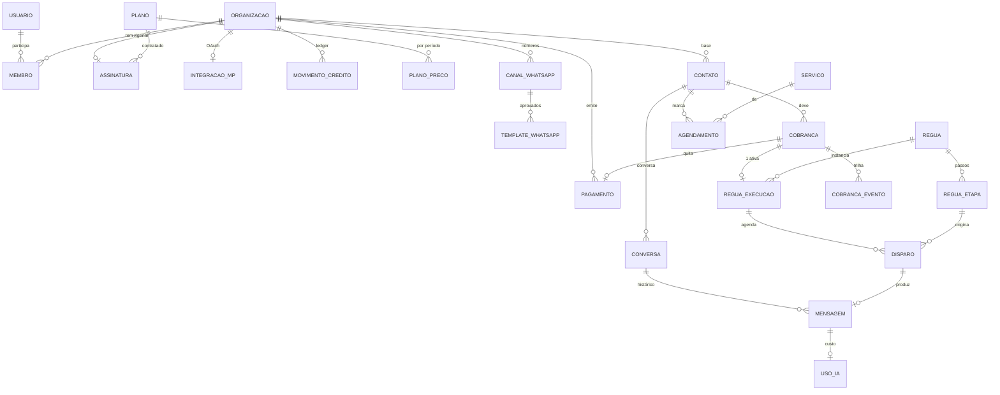

# AutoFlow — Modelo de dados

DDL executável: `db/migrations/0001_init.sql` (31 tabelas, 25 enums, 2 views).
Validado com o parser oficial do Postgres 17 (`pglast`) + linter de referências.

---

## 1. Visão geral

---

## 2. As cinco decisões que definem o schema

### 2.1 `contato` é a entidade central — não a cobrança

No protótipo, `Cobranca`, `Conversa` e `Agendamento` carregam cada um seu
`clienteNome`/`clienteTelefone`/`contatoTelefone` duplicados. Em produção isso
significa: o mesmo cliente com o telefone escrito de três jeitos, impossível dizer
"quantas cobranças a Marina tem em aberto", e opt-out que não vale para todos os canais.

Tudo aponta para `contato`, com `UNIQUE (org_id, telefone_e164)` e um `CHECK` de formato
E.164. **A normalização do telefone é regra de negócio, não de UI** — o mesmo número
chega como `(11) 99123-4501` do formulário e `5511991234501` do webhook da Meta.

### 2.2 Disparos materializados = a fila

`disparo` é simultaneamente o "próximos disparos" da tela e a fila do worker.
`UNIQUE (execucao_id, etapa_id)` faz da idempotência uma invariante de banco: worker
que morrer no meio do envio não duplica mensagem ao reprocessar.

A condição da etapa (`se_nao_pago`, `se_sem_resposta`) é reavaliada **na hora do envio**,
contra o estado atual — nunca no agendamento. Cliente que pagou ontem não recebe cobrança
hoje, mesmo com a linha já agendada.

### 2.3 Créditos são um ledger, não um contador

`movimento_credito` é append-only, com `UNIQUE (org_id, idempotencia)`. O saldo em
`organizacao.saldo_creditos` é cache mantido por trigger na mesma transação, com
`RAISE EXCEPTION` se ficar negativo — não dá para gastar o que não tem, nem por corrida
entre dois workers.

Isso responde "por que sumiu meu crédito?" com uma consulta, permite estorno e deixa
crédito de plano (com `expira_em`) morrer no fim do ciclo sem tocar no crédito comprado.

### 2.4 Template de WhatsApp é entidade de primeira classe

A Cloud API só deixa iniciar conversa fora da janela de 24h com template aprovado pela
Meta. Então `template_whatsapp` tem ciclo de vida próprio, e `regua_etapa` referencia
`template_id` com `ON DELETE RESTRICT` — apagar um template que uma régua ativa usa é
proibido pelo banco, não por um `if` na aplicação.

`variaveis_map` traduz a numeração da Meta (`{{1}}`, `{{2}}`) para o domínio
(`{"1":"contato.primeiro_nome","2":"cobranca.valor"}`), porque `VARIAVEIS_MENSAGEM` do
protótipo usa nomes e a API usa posição.

### 2.5 Preço contratado vive na assinatura

`assinatura.preco_contratado` guarda o valor fechado. Reajustar `plano.preco_mensal`
não mexe em quem já assinou (grandfathering) e o histórico financeiro continua
explicável seis meses depois.

---

## 3. Invariantes garantidas pelo banco

| Invariante | Mecanismo |
|---|---|
| 1 dono por organização | `ux_membro_dono` (unique parcial) |
| 1 assinatura vigente por org | `ux_assinatura_vigente WHERE status IN (trial,ativa,inadimplente)` |
| 1 régua ativa por cobrança | `ux_execucao_ativa WHERE status='ativa'` |
| 1 envio por etapa/execução | `UNIQUE (execucao_id, etapa_id)` |
| Sem overbooking na agenda | `EXCLUDE USING gist` com `tstzrange` |
| Webhook processado 1× | `UNIQUE (provedor, evento_id)` |
| Saldo de crédito ≥ 0 | trigger `tg_aplicar_credito` |
| `status='pago'` ⇔ `pago_em` preenchido | `ck_cobranca_pago` |
| 1 número principal por org | `ux_canal_principal WHERE principal` |
| Telefone em E.164 | `ck_contato_e164` |

> Regra adotada: **toda invariante que causa prejuízo financeiro ou vexame com o cliente
> final mora no banco.** Validação em TypeScript é para mensagem de erro bonita, não para
> garantia.

---

## 4. Multi-tenancy

Duas camadas:

1. **DAL** (`src/server/dal/*`) — `org_id` sempre vem da sessão, nunca de parâmetro.
2. **RLS** — política `isolamento_tenant` em toda tabela com `org_id`; a app faz
   `SET LOCAL app.org_id` por transação.

Fora da RLS de propósito: `membro` e `convite` (lidos no login, antes de existir org no
contexto), `evento_webhook` (chega sem tenant resolvido), `tarefa` e `log_auditoria`
(plataforma). Workers rodam com papel `BYPASSRLS`.

---

## 5. Do protótipo para as tabelas

| Protótipo (`src/lib/types.ts` / `mock-data.ts`) | Produção | Observação |
|---|---|---|
| `Conta` | `organizacao` + `assinatura` + `membro` | separa identidade, tenant e contrato |
| `Conta.creditosUsados/Totais` | `movimento_credito` + view | virou ledger |
| `Conexao` | `canal_whatsapp` | ganha `waba_id`, `phone_number_id`, token cifrado |
| `Cobranca.clienteNome/Telefone` | `contato` (FK) | deduplicação |
| `Cobranca.valor: number` (reais) | `valor bigint` (centavos) | **converter na migração** |
| `Regua` + `Etapa` | `regua` + `regua_etapa` | `hora` passa a ser hora local + fuso |
| `Regua.stats` | view `v_regua_stats` | derivado, nunca gravado |
| *(não existia)* | `regua_execucao` + `disparo` | motor da automação |
| `Conversa.mensagens[]` | `conversa` + `mensagem` | array vira tabela; `janela_expira_em` |
| `Agendamento` | `agendamento` + `servico` | `inicio/fim` timestamptz + anti-overbooking |
| `Transacao` | `pagamento` | + campos do Mercado Pago |
| `PLANOS`, `PACOTES_CREDITO` | `plano`, `plano_preco`, `pacote_credito` | seed em `0002` |
| `localStorage` | sessão + Postgres | fim do estado no cliente |

**Armadilha na conversão de dinheiro:** todo `valor` do protótipo está em reais como
`number`. Multiplicar por 100 em float gera `19699.999...`. Use
`Math.round(valor * 100)` — uma vez só, no script de importação.

---

## 6. LGPD e retenção

- `contato.opt_out_em` e `contato.bloqueado` são checados **antes de todo disparo**.
  "PARAR"/"SAIR" na resposta marca opt-out automaticamente.
- `parametro.retencao_mensagens_dias` (365 por padrão) alimenta job de expurgo.
- Exclusão de conta: `ON DELETE CASCADE` a partir de `organizacao` limpa o tenant inteiro;
  `log_auditoria` e `pagamento` são retidos pelo prazo fiscal antes do purge.
- Credenciais (`token_cif`, `access_token_cif`) são `bytea` cifrado com AES-256-GCM na
  aplicação, com `chave_versao` para rotação. Nunca saem da DAL.

---

## 7. Aberto para depois

- **Agenda por profissional**: hoje o `EXCLUDE` usa `org_id`. Quando houver mais de um
  atendente, trocar por `recurso_id` — migração simples, mas planejada.
- **Particionar `mensagem`** por mês quando passar de ~10M linhas.
- **Versionar régua**: editar régua com execuções ativas altera o comportamento das
  pendentes. Aceitável na v1; se virar problema, snapshot da etapa dentro de `disparo`.
